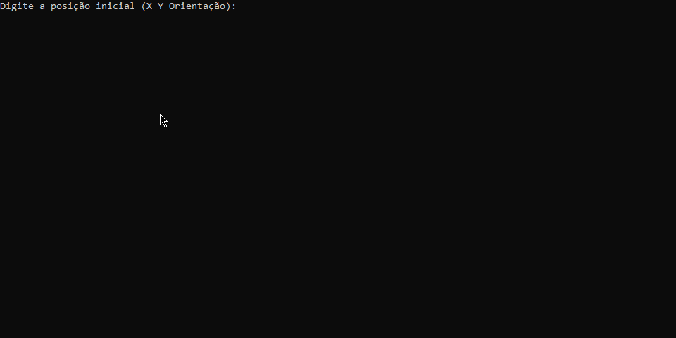

# 🤖 Robô Tupiniquim I - Desafio Academia-Progamador


Este projeto consiste no desenvolvimento do software de navegação para o **Robô Tupiniquim I**, um explorador espacial enviado pela Agência Espacial Brasileira (AEB) para mapear o terreno de Marte. O robô opera em um sistema de coordenadas cartesianas dentro de um grid pré-definido.



## 🚀 Funcionalidades

O sistema processa uma posição inicial e uma sequência de comandos para calcular a localização final do robô:

- **Movimentação:** O comando `M` move o robô uma unidade para a frente na direção atual.
- **Rotação:** Os comandos `E` (Esquerda) e `D` (Direita) giram o robô 90° sem sair da posição atual.
- **Rosa dos Ventos:** O robô reconhece as direções **N** (Norte), **S** (Sul), **L** (Leste) e **O** (Oeste).

## 🛠️ Tecnologias Utilizadas

- **Linguagem:** C# (.NET)
- **Paradigma:** Programação Orientada a Objetos (POO)
- **Editor:** Visual Studio Code

## ⌨️ Como Executar o Projeto

Para rodar o projeto em sua máquina, siga os passos abaixo:

1. **Pré-requisitos:** Certifique-se de ter o [SDK do .NET](https://dotnet.microsoft.com/download) instalado.
2. **Abrir o Terminal:** Navegue até a pasta onde o arquivo do projeto está localizado.
3. **Comando de Execução:** Digite o seguinte comando e aperte Enter:
   ```bash
   dotnet run Progam.cs